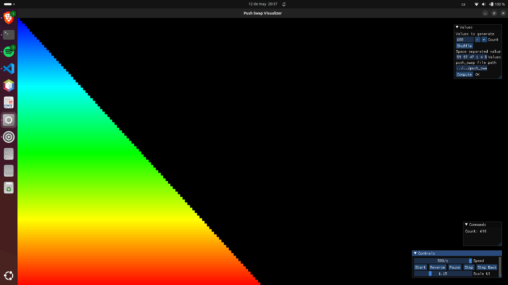
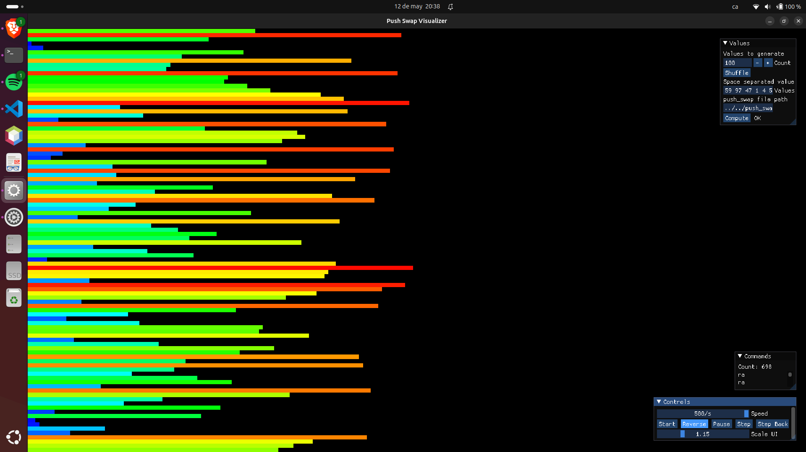

# Push and swap

`push_swap` es un proyecto de algoritmia y optimización desarrollado en C.  
El objetivo principal del proyecto es ordenar una lista de números enteros utilizando un conjunto limitado de operaciones predefinidas sobre dos stacks (`a` y `b`), buscando obtener la solución con el menor número posible de movimientos.

## Estructura del Proyecto

- **Algoritmo:** implementé el algoritmo Radix que para un stack de 100 elementos, me ofrece un promedio de 700 movimientos.
- **Manejo de errores:** detección y gestión de entradas no válidas, duplicados, y otros casos de error.
- **Evaluación de rendimiento:** enfoque en el análisis y reducción del número de movimientos requeridos.

```bash
./push_swap [números a ordenar]
```




## Fuentes

He testeado este proyecto con ayuda del push_swap_visualizer: 
https://github.com/o-reo/push_swap_visualizer
Desde push_swap_visualizer/build/bin, al usar este visualizer he testeado con el comando:
```bash
./visualizer ../push_swap/push_swap
```

[GitHub](https://github.com/topics/pushswap-42)
[Stackoverflow](https://stackoverflow.com/questions/24635074/can-you-use-define-to-change-a-include)
[Khan](https://es.khanacademy.org/computing/computer-science)
[VisualGo](https://visualgo.net/en)
